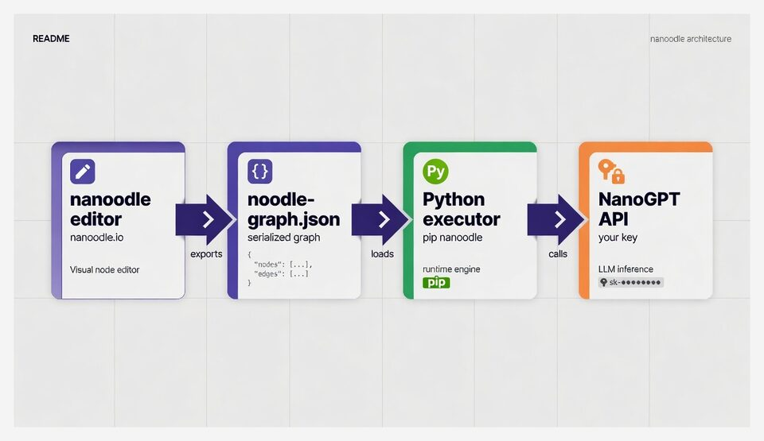
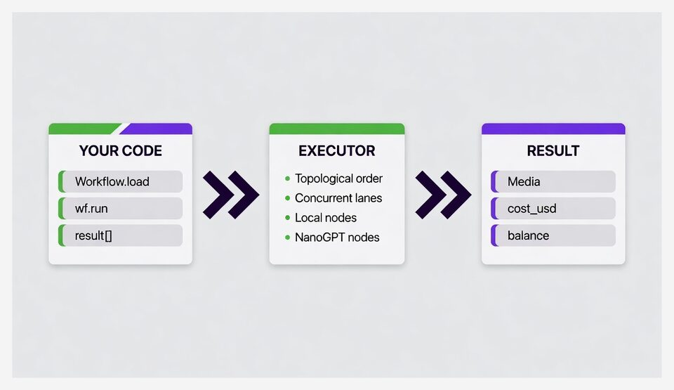

# nanoodle (Python)

**Run visual AI workflows from Python.** Design them in the
[nanoodle](https://nanoodle.com) editor, save as `noodle-graph.json`, then load
and re-run them here — same graph, same [NanoGPT](https://nano-gpt.com) API,
your own key.

Zero runtime dependencies (stdlib only). Library + CLI in one install.

Looking for JavaScript / Node? → **[nanoodle-js](https://github.com/nanoodlecom/nanoodle-js)**

## At a glance



**Build once, run anywhere.** The browser app is for designing and testing.
This package is for automating the same workflows in scripts, servers, and
agents.



| | |
|---|---|
| **Package** | `nanoodle` on PyPI |
| **Runtime** | Python ≥ 3.9 · stdlib only · no deps |
| **Sibling** | [JavaScript package](https://github.com/nanoodlecom/nanoodle-js) (same graphs, same semantics) |
| **Editor** | [nanoodle.com](https://nanoodle.com) — wire nodes, hit 💾, download the graph |

## Install

```bash
pip install nanoodle
export NANOGPT_API_KEY=...   # nano-gpt.com API key (or OAuth access token)
```

## Quickstart (library)

```python
from nanoodle import Workflow

wf = Workflow.load("noodle-graph.json")
result = wf.run({"Text": "a cozy ramen shop on a rainy night"})
result["Image"].save("ramen.png")            # media: MediaRef (url + bytes()/save())
print(result.cost_usd, result.remaining_balance)
```

With the app’s starter graph (text → LLM prompt-writer → image), that’s the whole program.

### The URL is the package

Every nanoodle share link is a runnable artifact. Anywhere a `graph.json` path
is accepted — `Workflow.load` or the CLI — a share link works just as well:

```python
wf = Workflow.load("https://nanoodle.com/#g=...")          # workflow link
wf = Workflow.load("https://nanoodle.com/play.html#a=...")  # app link (graph only)
```

Workflow links (`#g=`/`#j=`) and app links (`#a=`, graph only — the app shell
stays in the browser) both decode, as do `da.gd`/TinyURL short links (resolved
by reading redirect headers; no credentials are ever sent). Direct fragment
links decode **fully offline** — zero network I/O, stdlib only. Paste one
straight from a README, a chat, or a tweet.

### Discover a workflow’s interface

```python
wf.inputs    # [InputSpec(key="Text", node_id="n1", field="text", kind="textarea", ...)]
wf.outputs   # [OutputSpec(key="Image", node_id="n3", type="image", ports=["image"])]
wf.settings  # [SettingSpec(key="n3.size", kind="select", default="1k", ...)]
```

Input keys are flexible (case-insensitive): the node’s custom name, `nodeId.field`
(`"n2.system"`), or the input’s label when unique. A workflow with exactly one
required input also accepts a bare value: `wf.run("hello")`.

### Media inputs

```python
from nanoodle import media_from_file

wf.run({"Image": media_from_file("photo.jpg")})            # local file
wf.run({"Image": "https://example.com/photo.jpg"})         # hosted or data: URL
wf.run({"Image": raw_bytes})                               # raw bytes (MIME sniffed)
```

Media is sent inline as base64 (NanoGPT has no upload endpoint). Files over
~4.4 MB (~3.5 MB for transcription) are refused locally with a clear error
before any paid call.

### Settings, progress, errors

```python
result = wf.run(
    {"Text": "sunset harbor"},
    settings={"n3.model": "flux-dev", "n3.size": "1k"},
    timeout=600,
    on_progress=lambda evt: print(evt["type"], evt.get("name", "")),
)
```

`run()` raises `RunError` when an output (sink) node fails — `error.result`
still has partial results, per-node statuses, and cost so far. Failures in
lanes no output depends on only appear in `result.errors`. Unknown/unsupported
node types, missing required inputs, bad keys, and a missing API key all fail
**before** anything is spent.

## CLI

Installed as `nanoodle-py` (and `python -m nanoodle` always works):

```bash
nanoodle-py inspect graph.json
nanoodle-py run graph.json --input Text="a cozy ramen shop" --set n3.size=1k --out ./out
nanoodle-py run graph.json --input n2.system=@style.txt --json
nanoodle-py run graph.json --env-file .env --input Text="hello"   # NANOGPT_API_KEY from a .env file
nanoodle-py inspect "https://nanoodle.com/#g=..."                 # a share link works too (quote it — # is a shell comment)
```

- `--out DIR` — save media outputs to files
- `--json` — machine-readable result
- `--env-file PATH` — load `.env`-style `KEY=VALUE` lines (existing env vars win)

## Supported nodes

| runs | node types |
|---|---|
| local | text, upload (image/audio/video), choice, join, comment |
| NanoGPT | llm (incl. vision + audio input), image, draw, edit, inpaint*, vision, tvideo, ivideo, vedit, lipsync, music, remix, tts, transcribe |
| **not supported** (browser-only media processing) | resize, vframes, combine, soundtrack, trim, extractaudio |

Workflows with unsupported node types load with a warning and fail fast at
`run()` with `UnsupportedNodeError` — before any network call.

\* **inpaint:** the browser app composites the mask onto black at the source
pixel size; this library passes your mask through verbatim. Supply a
black/white mask matching the source dimensions.

## Use it as an agent skill

A saved workflow plus a short `SKILL.md` playbook is a skill any coding agent
can run — Claude Code, Cursor, Grok, or anything that reads markdown and runs
shell. Recipe and template: [docs/agent-skills.md](docs/agent-skills.md).

**Example skill** (idea → LLM prompt → poster image):

```bash
npx skills add nanoodlecom/nanoodle-py@poster-generator -g -y
pip install nanoodle   # CLI used by the skill
```

Source: [examples/agent-skill/poster-generator/](examples/agent-skill/poster-generator/).
Media is saved as `Poster.<ext>` (MIME-derived; often `.jpg`) — use the path the
CLI prints. The JavaScript package ships the same skill name; installing both
overwrites — pick one runtime (see [agent-skills.md](docs/agent-skills.md)).

## Cost

Bring your own NanoGPT API key; NanoGPT bills your balance per generation and
reports the price on each response.

- `result.cost_usd` — total of prices returned
- `result.cost_exact` — `False` if any call omitted a price (total is then a floor)
- `result.remaining_balance` — freshest balance the API reported

A price of `0` means known-included (subscription), not unknown. No telemetry,
no analytics; the API key is never logged.

## No account at all: pay per run in Nano (x402)

NanoGPT supports x402 accountless payments: call the API with no key, get an
HTTP 402 invoice, settle it in Nano (XNO — instant, feeless), and the call
completes. nanoodle wires that up end to end:

```bash
# each paid call prints a Nano invoice (nano: URI + address) on stderr and waits
python -m nanoodle run "https://nanoodle.com/#g=..." --input Text="hello" --pay
```

```python
wf = Workflow.load(url, payment=lambda inv:
    my_wallet.send(inv["payTo"], inv["amountRaw"]))  # YOUR signer does the send
```

The library **never touches funds or keys**: ``payment`` must be a callable —
passing a seed or private-key string raises. Do the send inside the callback
with your own wallet/signer, or show ``inv["uri"]`` for a human to scan. Each
API call pays at most once; graphs with several paid nodes produce one small
invoice per node. The invoice dict is field-identical to nanoodle-js's, so
payment callbacks port between the two libraries unchanged.

### Accountless image, start to finish

The starter graph (text → LLM prompt-writer → image), run with **no NanoGPT
account and no API key** — pay the Nano invoice, and the image node settles
for a few cents of XNO:

```bash
python -m nanoodle run noodle-graph.json --input Text="a cozy ramen shop on a rainy night" --pay --out ./noodle-out
# → LLM node runs, image node prints a nano: invoice, waits for the deposit,
#   then writes noodle-out/Image.jpg
```


## Testing

Tests run fully offline against a mock NanoGPT server (`tests/harness/`):

```bash
python -m unittest discover -s tests -t .
```

Opt-in live probe (spends a fraction of a cent):
`python3 scripts/live-spot-check.py` (add `--image` to also run the starter
graph’s image step).

## Docs

Design contract and format/engine/io specs live in [`docs/`](docs/):
`DESIGN.md`, `SPEC-format.md`, `SPEC-engine.md`, `SPEC-io.md`.

Same contract as the [JavaScript package](https://github.com/nanoodlecom/nanoodle-js).

## License

MIT — see [LICENSE](LICENSE). Not affiliated with NanoGPT. Build workflows at
[nanoodle.com](https://nanoodle.com).
