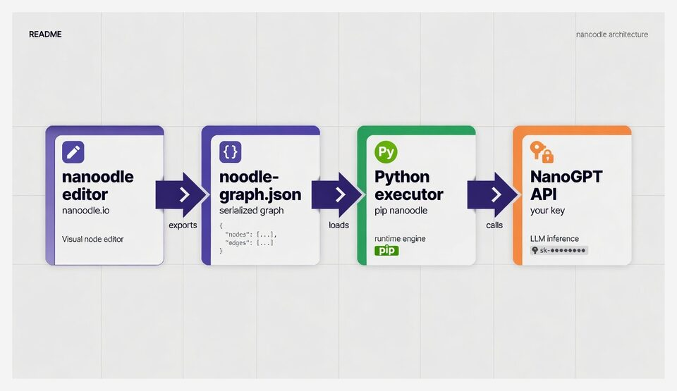
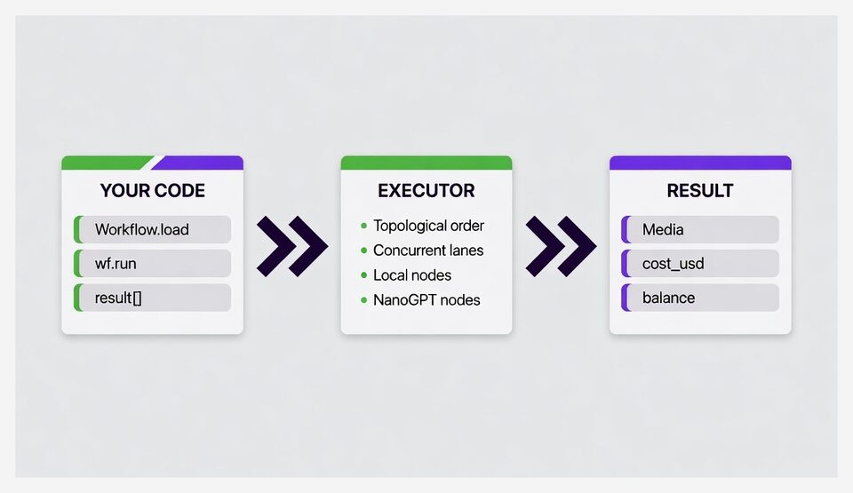

# nanoodle (Python)

**Run visual AI workflows from Python.** Design them in the
[nanoodle](https://nanoodle.com) editor, save as `noodle-graph.json`, then load
and re-run them here — same graph, same [NanoGPT](https://nano-gpt.com) API,
your own key.

Zero runtime dependencies (stdlib only). Library + CLI in one install.

Looking for JavaScript / Node? → **[nanoodle-js](https://github.com/nanoodlecom/nanoodle-js)**
Running graphs in GitHub CI → [run-noodle-action](https://github.com/nanoodlecom/run-noodle-action) · saved graphs as AI-agent tools → [nanoodle-mcp](https://github.com/nanoodlecom/nanoodle-mcp) · Agent Skills → [nanoodle-skill](https://github.com/nanoodlecom/nanoodle-skill) / [noodle-skills](https://github.com/nanoodlecom/noodle-skills)

## At a glance



**Build once, run anywhere.** The browser app is for designing and testing.
This package is for automating the same workflows in scripts, servers, and
agents.



| | |
|---|---|
| **Package** | `nanoodle` on PyPI |
| **Runtime** | Python ≥ 3.9 · stdlib only · no deps |
| **Sibling** | [JavaScript package](https://github.com/nanoodlecom/nanoodle-js) (same graphs, same semantics) |
| **Editor** | [nanoodle.com](https://nanoodle.com) — wire nodes, hit 💾, download the graph |

## Install

```bash
pip install nanoodle
export NANOGPT_API_KEY=...   # nano-gpt.com API key (or OAuth access token)
```

Requires **0.2.0+** for share-link loading, the local media nodes
(resize/vframes/combine/soundtrack/trim/extractaudio), and x402 `--pay`.

## Quickstart (library)

```python
from nanoodle import Workflow

wf = Workflow.load("noodle-graph.json")
result = wf.run({"Text": "a cozy ramen shop on a rainy night"})
img = result["Image"]                        # media: MediaRef (url + bytes()/save())
img.save("ramen." + img.suggested_extension())   # extension matches the actual MIME (often jpg)
print(result.cost_usd, result.remaining_balance)
```

With the app’s starter graph (text → LLM prompt-writer → image), that’s the whole program.

### The URL is the package

Every nanoodle share link is a runnable artifact. Anywhere a `graph.json` path
is accepted — `Workflow.load` or the CLI — a share link works just as well:

```python
wf = Workflow.load("https://nanoodle.com/#g=...")          # workflow link
wf = Workflow.load("https://nanoodle.com/play.html#a=...")  # app link (graph only)
```

Workflow links (`#g=`/`#j=`) and app links (`#a=`, graph only — the app shell
stays in the browser) both decode, as do `da.gd`/TinyURL short links (resolved
by reading redirect headers; no credentials are ever sent). Direct fragment
links decode **fully offline** — zero network I/O, stdlib only. Paste one
straight from a README, a chat, or a tweet.

Links mangled in transit (a character flipped or dropped by a chat app or a
copy/paste) are recovered best-effort: the graph's nodes and wires are salvaged
and a warning is surfaced on `wf.warnings`. Only damage inside the graph itself
makes a link unrecoverable.

### Discover a workflow’s interface

```python
wf.inputs    # [InputSpec(key="Text", node_id="n1", field="text", kind="textarea", ...)]
wf.outputs   # [OutputSpec(key="Image", node_id="n3", type="image", ports=["image"])]
wf.settings  # [SettingSpec(key="n3.size", kind="select", default="1k", ...)]
```

Input keys are flexible (case-insensitive): the node’s custom name, `nodeId.field`
(`"n2.system"`), or the input’s label when unique. A workflow with exactly one
required input also accepts a bare value: `wf.run("hello")`.

An input node the author marked **optional** in the editor (the checkbox, saved as
`fields.optional`) is skippable: `spec.optional` is `True`, and a run that omits it
proceeds with an empty value that consumers drop — an optional style reference costs
you nothing when you leave it out.

#### Breaking in 0.5.0: named nodes now name their input key

A node with a custom name that surfaces exactly one input uses that name as the input key,
even when the input is optional. This matches nanoodle-js 0.8.0, so one set of keys now
works in both languages. It **renames advertised keys** on published workflows. Run
`nanoodle-py inspect <graph>` to see the current keys, or use `nodeId.field`
(`"n2.system"`), which never changes.

| workflow | 0.4.0 key | 0.5.0 key | old key still resolves? |
|---|---|---|---|
| pr-describe | `System prompt` | `Drafter` | no — now ambiguous across 3 nodes |
| pr-describe | `System prompt 2` | `Auditor` | no |
| pr-describe | `System prompt 3` | `Final PR body` | no |
| jingle | `System prompt` | `Lyric writer` | no — now ambiguous across 2 nodes |
| jingle | `System prompt 2` | `Style writer` | no |
| visual-judge | `System prompt` | `Verdict` | yes — the label is unique |
| narrated-poem | `System prompt` | `Poet` | yes |
| video-teaser | `System prompt` | `Shot writer` | yes |

Where the old label still names exactly one input it keeps resolving, so those calls need
no change. Where two or more nodes shared it, the old key now raises `ambiguous` (or
`unknown input` for the numbered forms) instead of silently picking one — the call fails
loudly and costs nothing.

### Media inputs

```python
from nanoodle import media_from_file

wf.run({"Image": media_from_file("photo.jpg")})            # local file
wf.run({"Image": "https://example.com/photo.jpg"})         # hosted or data: URL
wf.run({"Image": raw_bytes})                               # raw bytes (MIME sniffed)
```

Media is sent inline as base64 (NanoGPT has no upload endpoint). Files over
~4.4 MB (~3.5 MB for transcription) are refused locally with a clear error
before any paid call.

### Settings, progress, errors

```python
result = wf.run(
    {"Text": "sunset harbor"},
    settings={"n3.model": "flux-dev", "n3.size": "1k"},
    timeout=600,
    on_progress=lambda evt: print(evt["type"], evt.get("name", "")),
)
```

`timeout=` bounds the whole run. When it fires, `run()` returns straight away
and the in-flight nodes stop polling within about a second, so the process is
free to exit. Without `timeout=`, each node still waits out its own limit
(video 600 s, audio 300 s).

The deadline bounds the run, and nothing else. Media a node already produced
stays fetchable after it: `result["Image"].save("out.png")` works once the
deadline has passed, and works for a lane that finished while another lane
timed out.

`run()` raises `RunError` when an output (sink) node fails — `error.result`
still has partial results, per-node statuses, and cost so far. Failures in
lanes no output depends on only appear in `result.errors`. Unknown/unsupported
node types, missing required inputs, bad keys, and a missing API key all fail
**before** anything is spent.

### Prompt length caps

Many image and video models reject a prompt over a fixed character count (HTTP 400,
`prompt_too_long`) before anything is charged. In a graph that prompt is usually written
by an upstream LLM, so there is nothing you can shorten. nanoodle trims the prompt to the
model's cap at a sentence boundary and tells you it did:

```python
result = wf.run({"Text": "..."}, on_progress=print)
# {'node_id': 'n3', 'name': 'Image', 'from': 1440, 'to': 780, 'cap': 800, 'type': 'prompt-trimmed'}
result.prompt_trims   # the same records, for a caller that passed no on_progress
```

Every trim is also reported as a `RuntimeWarning`. Reporting can never fail your run: if
you run with warnings as errors (`PYTHONWARNINGS=error`), the same sentence goes to stderr
instead, and the run continues.

A cap counts **UTF-16 code units**, which is what the model route counts and what
nanoodle-js reports — not Python code points. One emoji is 1 code point and 2 code units,
so `"🎉" * 450` is 450 to `len()` and 900 to the API. `from` and `to` in the trim record are
code units for the same reason, and `nanoodle.prompt_caps.utf16_len` measures them.

A cap this library does not know yet is learned from the live 400 and applied on the next
run of the same `Workflow`. That applies to image, video and audio nodes. An `llm` or
`vision` node is never fitted (its real limit is tokens), so its rejection is relayed
exactly as the API worded it, with no promise that a retry would behave differently.

Your own prompts are never rewritten, summarised or added to — the library only ever cuts
an over-length prompt at the end, and always says so. `PROMPT_CAPS`, `prompt_cap`,
`fit_prompt_text`, `is_prompt_too_long` and `prompt_cap_from_error` are public, for
callers that do their own orchestration.

## CLI

Installed as `nanoodle-py` (and `python -m nanoodle` always works):

```bash
nanoodle-py inspect graph.json
nanoodle-py run graph.json --input Text="a cozy ramen shop" --set n3.size=1k --out ./out
nanoodle-py run graph.json --input n2.system=@style.txt --json
nanoodle-py run graph.json --env-file .env --input Text="hello"   # NANOGPT_API_KEY from a .env file
nanoodle-py inspect "https://nanoodle.com/#g=..."                 # a share link works too (quote it — # is a shell comment)
```

- `--out DIR` — save media outputs to files
- `--json` — machine-readable result
- `--env-file PATH` — load `.env`-style `KEY=VALUE` lines (existing env vars win)

With `--json`, a **failed** run still prints the same JSON on stdout — per-node
`status` and `error`, the outputs that did complete, the cost already spent, and any
prompt trims — and exits 1. Without `--json` a failed run prints `error: …` on stderr
and exits 1, as before.

That includes a failure caught **before** the first node runs (a missing required input,
an unknown key, an unreadable graph). Nothing executed, so `nodes` is `{}` and `costUsd`
is `0.0`, and the reason is in `errors[0].message`:

```json
{"outputs": {"Answer": null}, "costUsd": 0.0, "costExact": true, "remainingBalance": null,
 "nodes": {}, "errors": [{"node_id": null, "name": null,
                          "message": "missing required input: Answer"}], "promptTrims": []}
```

## Supported nodes

| runs | node types |
|---|---|
| local | text, upload (image/audio/video), choice, join, comment |
| local media† | resize, vframes, combine, soundtrack, trim, extractaudio |
| NanoGPT | llm (incl. vision + audio input), image, edit, inpaint*, vision, tvideo, ivideo, vedit, lipsync, music, remix, tts, transcribe |

† **local media** needs **ffmpeg** on `PATH` (soft dependency — not a PyPI package). Same behaviour as the browser app; clear error if ffmpeg is missing.

\* **inpaint:** the browser app composites the mask onto black at the source
pixel size; this library passes your mask through verbatim. Supply a
black/white mask matching the source dimensions.

## Use it as an agent skill

A saved workflow plus a short `SKILL.md` playbook is a skill any coding agent
can run — Claude Code, Cursor, Grok, or anything that reads markdown and runs
shell. Recipe and template: [docs/agent-skills.md](docs/agent-skills.md).

**Example skill** (idea → LLM prompt → poster image):

```bash
npx skills add nanoodlecom/nanoodle-py@poster-generator -g -y
pip install nanoodle   # CLI used by the skill
```

Source: [examples/agent-skill/poster-generator/](examples/agent-skill/poster-generator/).
Media is saved as `Poster.<ext>` (MIME-derived; often `.jpg`) — use the path the
CLI prints. The JavaScript package ships the same skill name; installing both
overwrites — pick one runtime (see [agent-skills.md](docs/agent-skills.md)).

## Cost

Bring your own NanoGPT API key; NanoGPT bills your balance per generation and
reports the price on each response.

- `result.cost_usd` — total of prices returned
- `result.cost_exact` — `False` if any call omitted a price (total is then a floor)
- `result.remaining_balance` — freshest balance the API reported

A price of `0` means known-included (subscription), not unknown. No telemetry,
no analytics; the API key is never logged.

## No account at all: pay per run in Nano (x402)

NanoGPT supports x402 accountless payments: call the API with no key, get an
HTTP 402 invoice, settle it in Nano (XNO — instant, feeless), and the call
completes. nanoodle wires that up end to end:

```bash
# each paid call prints a Nano invoice (nano: URI + address) on stderr and waits
python -m nanoodle run "https://nanoodle.com/#g=..." --input Text="hello" --pay
```

```python
wf = Workflow.load(url, payment=lambda inv:
    my_wallet.send(inv["payTo"], inv["amountRaw"]))  # YOUR signer does the send
```

The library **never touches funds or keys**: ``payment`` must be a callable —
passing a seed or private-key string raises. Do the send inside the callback
with your own wallet/signer, or show ``inv["uri"]`` for a human to scan. Each
API call pays at most once; graphs with several paid nodes produce one small
invoice per node. The invoice dict is field-identical to nanoodle-js's, so
payment callbacks port between the two libraries unchanged.

Money that leaves the wallet stays traceable. `result.payments` lists every
deposit the run asked for (`payment_id`, `amount`, `pay_to`, `explorer_url`,
`status`, `send_error`, `redeemed`), and a deposit that never bought its request
is named in the node's error message too — including when a `timeout=` abandoned
the node that sent it, and when the paid call itself answered an error. `status`
is the money fact: `sent` means your callback returned, `failed` means it raised
and nothing was deposited, and the error message says which. A settled deposit
always gets its request: the run deadline never cancels the one call the user
has already paid for.

Copy-paste scripts (CLI, print callback, wallet stub):
[examples/x402/](examples/x402/).

### Accountless image, start to finish

The starter graph (text → LLM prompt-writer → image), run with **no NanoGPT
account and no API key** — pay the Nano invoice, and the image node settles
for a few cents of XNO:

```bash
python -m nanoodle run noodle-graph.json --input Text="a cozy ramen shop on a rainy night" --pay --out ./noodle-out
# → LLM node runs, image node prints a nano: invoice, waits for the deposit,
#   then writes noodle-out/Image.jpg
```


## Testing

Tests run fully offline against a mock NanoGPT server (`tests/harness/`):

```bash
python -m unittest discover -s tests -t .
```

Opt-in live probe (spends a fraction of a cent):
`python3 scripts/live-spot-check.py` (add `--image` to also run the starter
graph’s image step).

## Docs

Design contract and format/engine/io specs live in [`docs/`](docs/):
`DESIGN.md`, `SPEC-format.md`, `SPEC-engine.md`, `SPEC-io.md`.

Same contract as the [JavaScript package](https://github.com/nanoodlecom/nanoodle-js).

## License

MIT — see [LICENSE](LICENSE). Not affiliated with NanoGPT. Build workflows at
[nanoodle.com](https://nanoodle.com).
